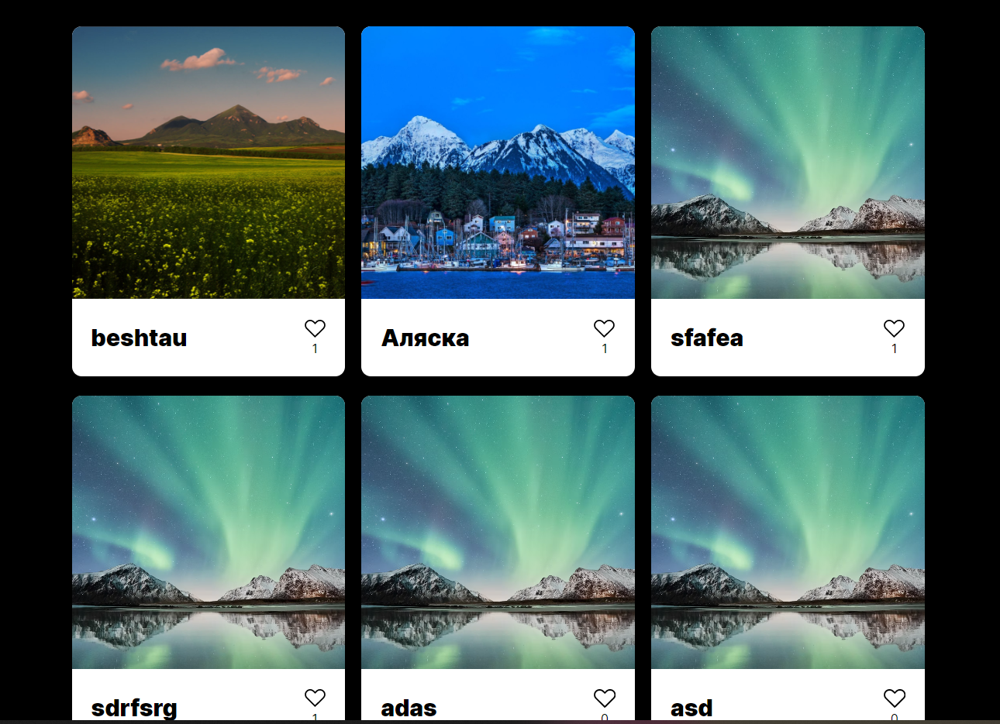
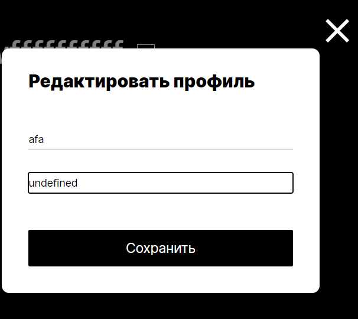
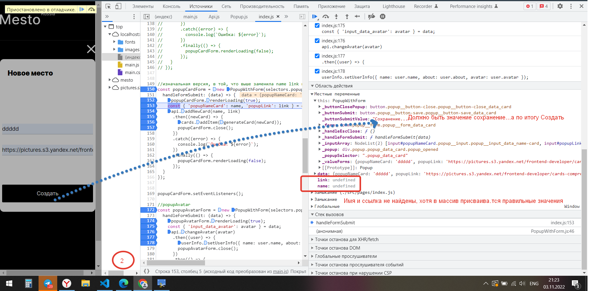
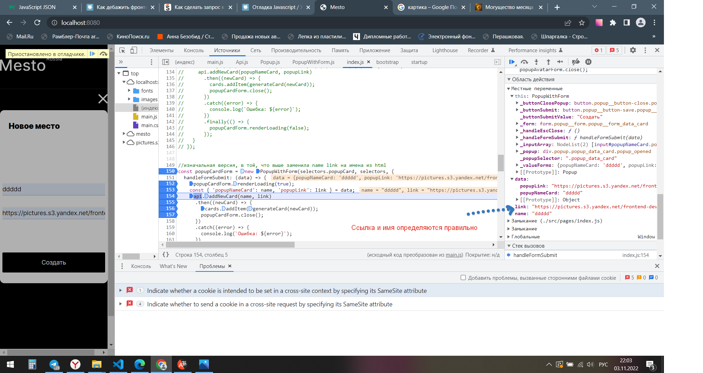
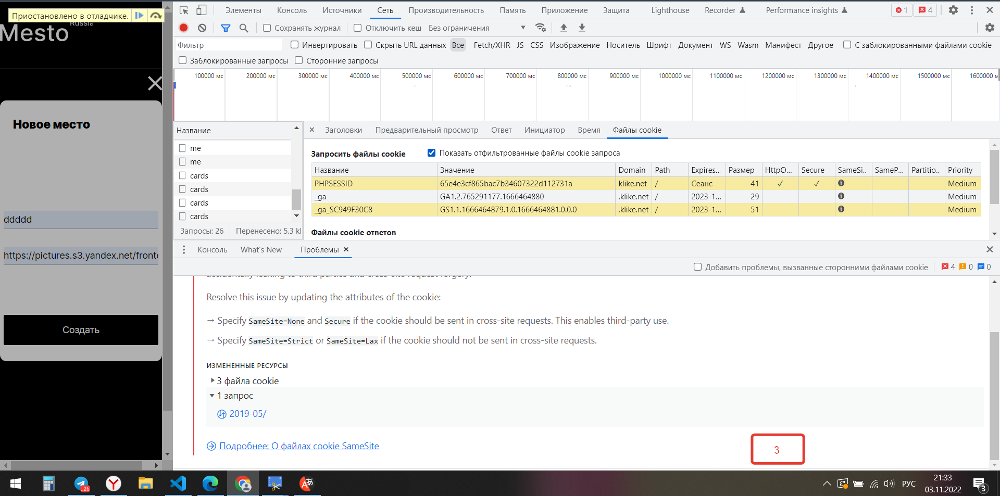
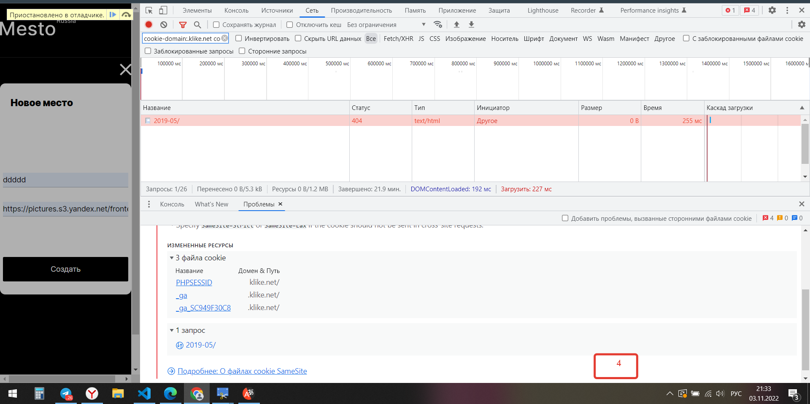
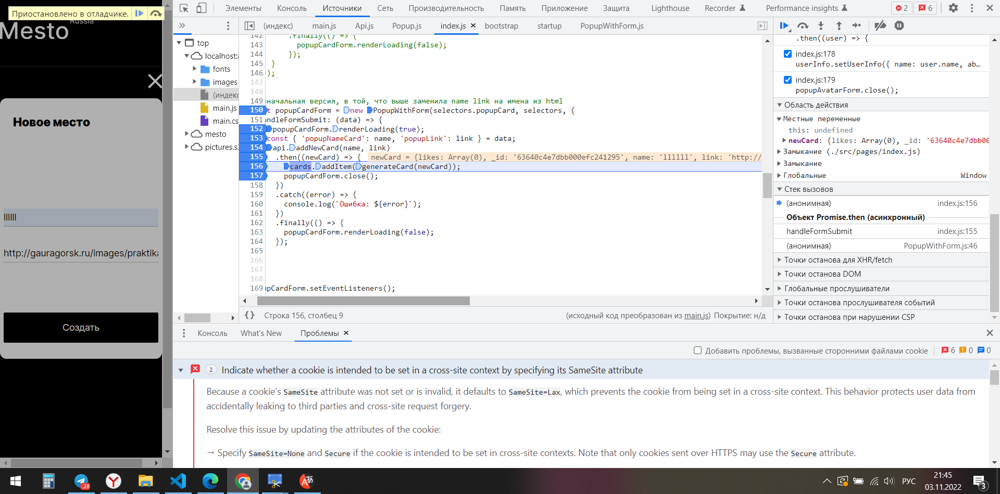
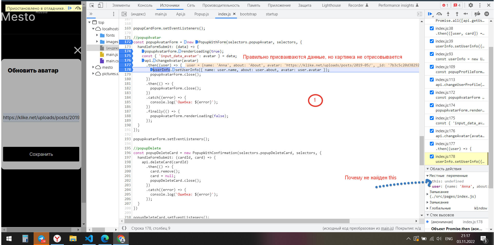
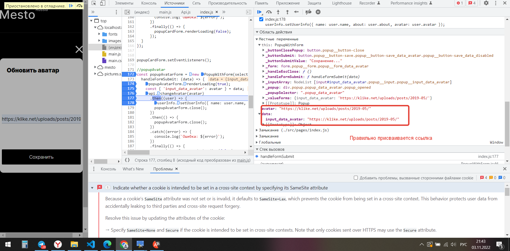

# 🚀 Не работает API


**Главная проблема:**
```
1. Не отображаются карточки на странице
2. Не отображается/не сохраняется аватарка
3. В графе "О себе" отображается undefined
4. Нет возможности ставить лайкина картинки, потому что их нет
```

**Описание:**
1. При открытии страницы должны загружаться разные карточки с картинками

при открытии моей страницы невозможно загрузить картинки

2. При нажатии на место, где должна быть аватарка появляется значок


открывается попап, куда можно добавить ссылку и по итогу должна загружаться аватарка, но сейчас вместо аватарки черное пространство, 
при наведении мыши нужный значок появляется

3. В графе "О себе" отображается undefined, если перед этим графа не была заполнена




**Ссыла на то, как должна выглядеть работа**
[Образец работы](https://viktor-timofeev.github.io/mesto/)


**Ссыла на мою работу**
[Путешествия по Место](https://are-new-ta.github.io/mesto/ "красивое")


**Как я пытаюсь решить проблему**

1. В массив data правильно присваиваются значения имени и ссылки, кнопка "СОЗДАТЬ" должна меняться на "Сохранение ..." при загрузке карточки,
но ничего не меняется по факту



Несмотря на то, что к нужным параметрам присваиваются верные данные никакая карточка не появляется и никак не реагирует кнопка "Создать"










2. Данные присваиваются правильно, но ничего не загружается на страницу




