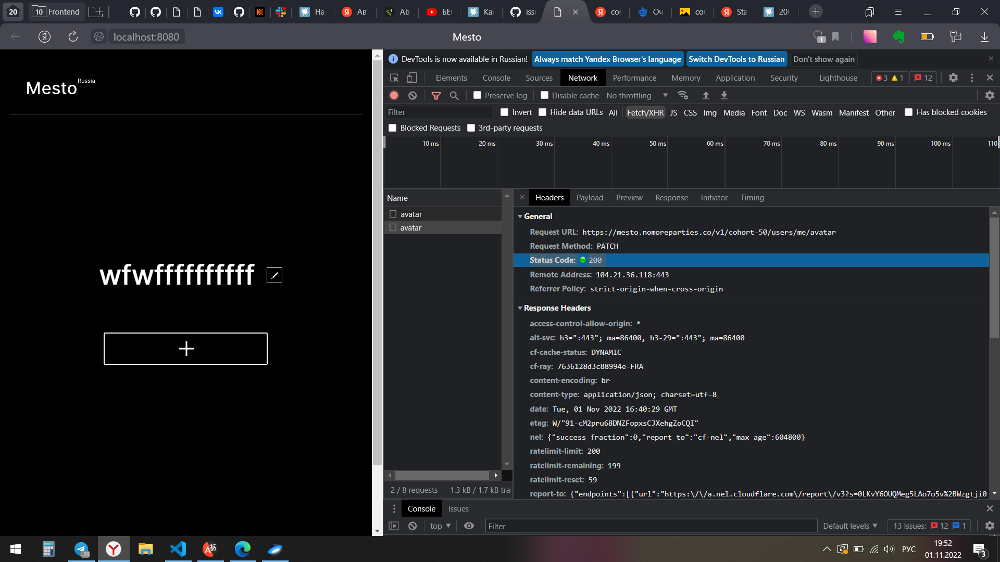

# 🚀 Не работает API


**Главная проблема:**
```
1. Не отображаются карточки на странице
2. Не отображается/не сохраняется аватарка
3. Не сохраняются введенные данные в графу "О себе"
4. В графе "О себе" отображается undefined
5. Нет возможности ставить лайкина картинки, потому что их нет
```

**Описание:**
1. При открытии страницы должны загружаться разные карточки с картинками

при открытии моей страницы невозможно загрузить картинки

2. При нажатии на место, где должна быть аватарка появляется значок


открывается попап, куда можно добавить ссылку и по итогу должна загружаться аватарка, но сейчас вместо аватарки черное пространство, 
при наведении мыши нужный значок появляется

3. В инпутах "Имя" и "О себе" должны сохраняться введенные данные в соответствующий попап
На данный момент у меня в графу "Имя", введённые данные сохраняютс, а в "О себе" сорхранение отсутствует


4. В графе "О себе" отображается undefined и при вводе новых данных submit не срабатывает и в данном инпуте ничего не отображается


**Ссыла на то, как должна выглядеть работа**
[Образец работы](https://viktor-timofeev.github.io/mesto/)


**Как я пытаюсь решить проблему:**
1. При попытке загрузить аватарку появляются ошибки в консоли, но при этом статус код 200
Аватарка не загружается




**Ссыла на мою работу**
[Путешествия по Место](https://are-new-ta.github.io/mesto/ "красивое")