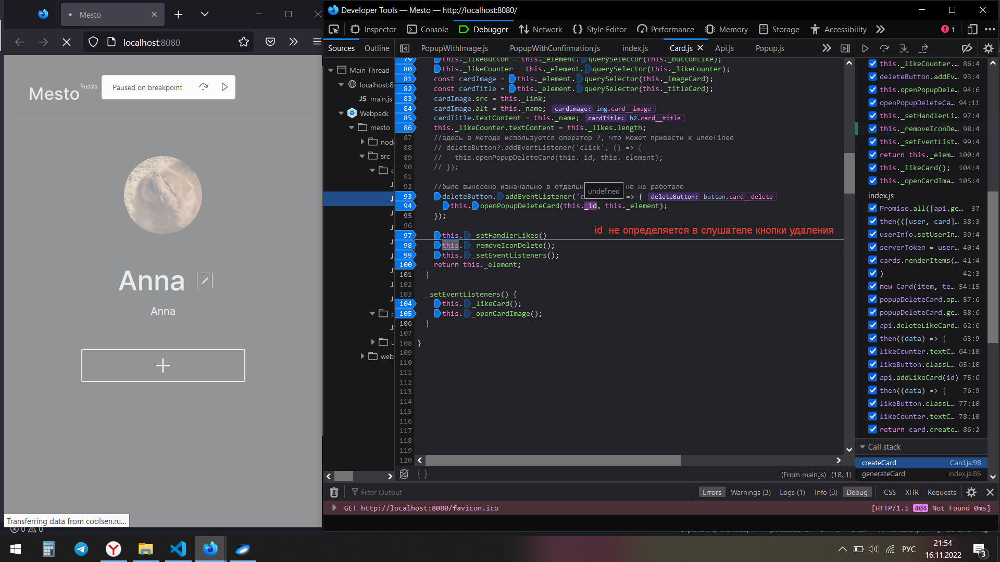
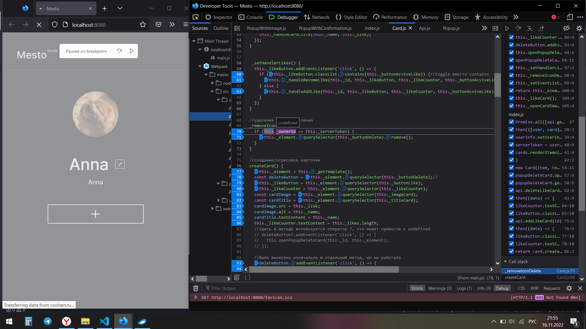
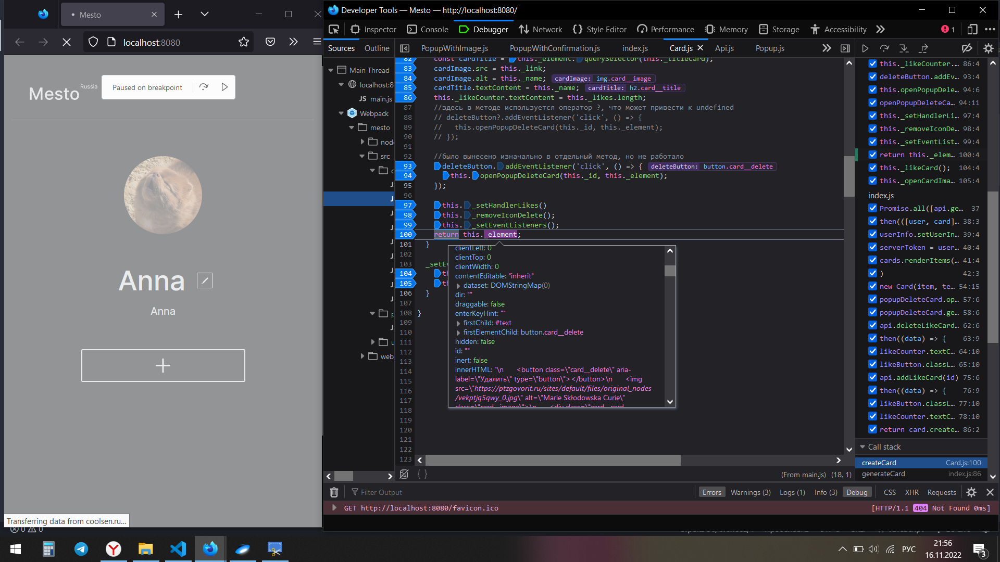
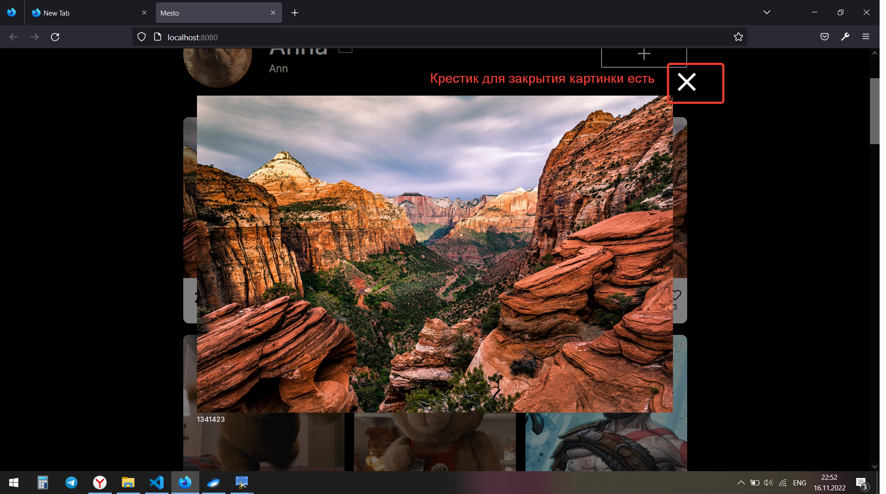

# 🚀 Не работает API


**Главная проблема:**
```
1. Не работает кнопка Удаления карточки (Не работает кнопка popup Delete)
2. Не определяется id при желании удалить или лайкнуть карточку
3. Ошибки TypeError: failed fetch
4. Разный вид при открытии на ПК и через GitHub
```

**Описание:**
1. При  нажатии на кнопку удаления картинки должен появляться popup Delete, с подтверждением об удалении
После подтверждения удаления попап должен закрыться, а картинка - удалиться


2. Не получается извлечь id через Api, видимо по этой же причине не получается ставить лайки и удалять,потому что id не найден









3. Ошибки TypeError: failed fetch


4. Разный вид при открытии на ПК и через GitHub: если открывать проект на моем ПК, то при открытии попапа картинки есть видимый крестик для закрытия попапа, но если открыть проект по ссылке в GitHub- ни в каких попапах крестик для закрытия не отображается

На ПК:



По ссылке:


**Какие проблемы удалось решить:**
1. Присваивание и сохранение в input UserJob данных 'О себе'
2. Кнопка удаления картинки отображается и при нажатии на нее открывается popupDelete
3. В index.js исправлена ошибка с неправильно использованными методами из Api
4. Можно загружать новые карточки и аватарки


**Ссыла на то, как должна выглядеть работа**
[Образец работы](https://viktor-timofeev.github.io/mesto/)


**Ссыла на мою работу**
[Путешествия по Место](https://are-new-ta.github.io/mesto/ "красивое")